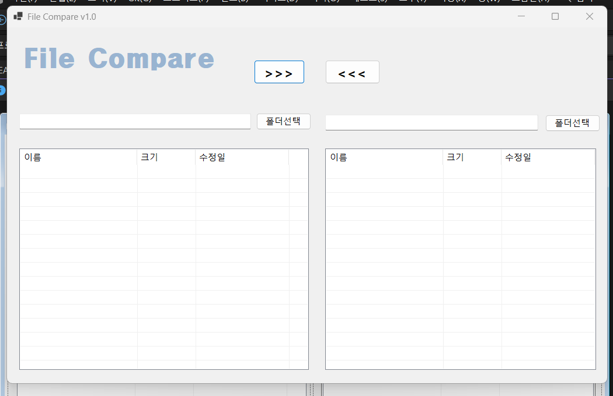
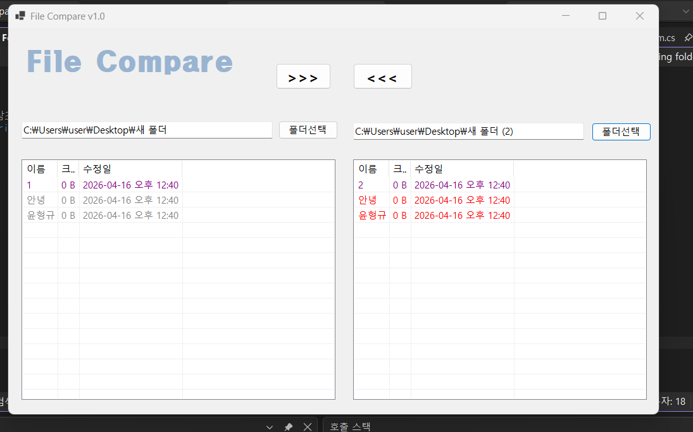

# (C# 코딩) 파일 비교 툴

## 개요
  - C# 프로그래밍 학습
  - 1줄 소개 : 두 파일의 내용을 비교하여 색상으로 차이점을 구분하고, 각 파일에 없는 파일을 복사해주는 프로그램
  - 사용한 플랫폼 : C#, .NET Windows Forms, Visual Studio, Github
  - 사용한 컨트롤 : Button, TextBox, Label, OpenFileDialog, FolderBrowserDialog, ListView, SplitContainer, Pannel, ColorDialog
  - 사용한 기술과 구현한 기능 :
	- VisualStudio를 이용하여 UI구현
	- OpenFileDialog와 FolderBrowserDialog를 이용하여 파일과 폴더 선택 기능 구현
	- ListView를 이용하여 파일과 폴더의 정보를 표시하고 비교
	- 색상을 이용하여 파일과 폴더의 차이점을 시각적으로 표시
	- 파일과 폴더의 크기와 수정 날짜를 비교하여 최신/오래된 항목 표시

## 실행 화면 (과제1)

- 코드의 실행 스크린샷과 구현 내용 설명

- 구현한내용(위그림참조)
  - 기본적인 UI구현
  - 파일과 폴더 선택 기능 구현

## 실행 화면 (과제2)

- 코드의 실행 스크린샷과 구현 내용 설명

- 구현한내용(위그림참조)
  - openFileDialog와 FolderBrowserDialog를 이용하여 파일과 폴더 선택 기능 구현
  - ListView를 이용하여 파일과 폴더의 정보를 표시하고 비교
  - 색상을 이용하여 파일과 폴더의 차이점을 시각적으로 표시

## 실행 화면 (과제3)